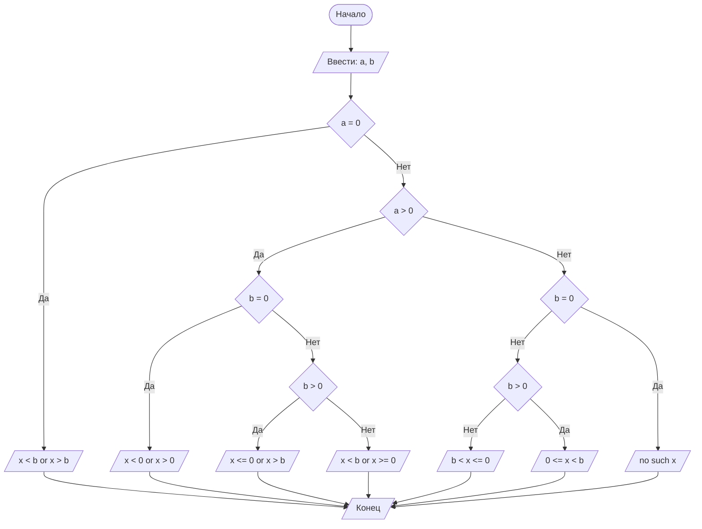

## Отчет по лабораторной работе № 1

#### № группы: `ПМ-2401`

#### Выполнил: `Голубев Павел Сергеевич`

#### Вариант: `8`

### Cодержание:

- [Постановка задачи](#1-постановка-задачи)
- [Входные и выходные данные](#2-входные-и-выходные-данные)
- [Выбор структуры данных](#3-выбор-структуры-данных)
- [Алгоритм](#4-алгоритм)
- [Программа](#5-программа)
- [Анализ правильности решения](#6-анализ-правильности-решения)

### 1. Постановка задачи
> Дано неравенство:
a·x/(x − b) ≥ 0
Где a и b — параметры (вводятся с клавиатуры). Решите его для x.

Найти все решения данного неравенства рассмотрев различные условия:
- а = 0
- а > 0
- a < 0  

### 2. Входные и выходные данные
#### Данные на вход

- На вход программа должна получать 2 числа, при этом в условии не сказано, к какому множеству
принадлежать получаемые числа, поэтому будем считать их вещественными.
#### Данные на выход
- На выход мы получим множество решений неравенств.

### 3. Выбор структуры данных

Программа получает 2 вещественных числа. Поэтому для их хранения
можно выделить 2 переменных (`a` и `b`) типа `double`.

|             | название переменной | Тип (в Java) | 
|-------------|---------------------|--------------|
| a (Число 1) | `a`                 | `double`     |
| b (Число 2) | `b`                 | `double`     | 

Для вывода результата необязательно его хранить в отдельной переменной.

### 4. Алгоритм

#### Алгоритм выполнения программы:

1. **Ввод данных:**  
   Программа считывает два вещественных числа, обозначенные как `a` и `b`.

2. **Зависимость от переменной `а`:**  
   Программа сравнивает значение переменной с 0 и если `а!=0`, то переходит к следующему шагу для работы с переменной `b` .

3. **Вывод результата:**  
   На экран выводится множество решений неравенства или сообщение о том, что решений нет.
#### Блок-схема




### 5. Программа


```import java.io.PrintStream;
import java.util.Scanner;
public class Main {
    public static Scanner in = new Scanner(System.in);
    public static PrintStream out = System.out;
    public static void main(String[] args) {
        double a = in.nextDouble(), b =in.nextDouble();
        if (a == 0)
            out.printf("x<" + "%.1f" + " or x>" + "%.1f" ,b ,b);
        else if (a > 0)
        {
            if (b == 0)
                out.print("x<0 or x>0");
            else if (b > 0)
                out.printf("x<=0 or x>" + "%.1f",b);
            else
                out.printf("x<" + "%.1f" + " or x>=0",b);
        }
        else
        {
            if (b == 0)
                out.print("no such x");
            else if (b > 0)
                out.printf("0<=x<" + "%.1f",b);
            else
                out.printf("%.1f" + "<x<=0",b);
        }
    }
}
```

### 6. Анализ правильности решения
Программа работает корректно на всем множестве решений с учетом ограничений.

1. Тест при `a = 0`

- Input:
    ```
    0
    1
    ```

- Output:
    ```
    x<1,0 or x>1,0
    ```

2. Тест при `a > 0` u `b = 0`

- Input:
    ```
    1
    0
    ```

- Output:
    ```
    x<0 or x>0
    ```
3. Тест при `a > 0` u `b > 0`

- Input:
    ```
    1
    1
    ```

- Output:
    ```
    x<=0 or x>1,0
    ```
4. Тест при `a > 0` u `b < 0`

- Input:
    ```
     1
    -1
    ```

- Output:
    ```
    x<-1,0 or x>=0
    ```
5. Тест при `a < 0` u `b = 0`

- Input:
    ```
    -1
     0
    ```

- Output:
    ```
    no such x
    ```
6. Тест при `a < 0` u `b > 0`

- Input:
    ```
    -1
     1
    ```

- Output:
    ```
    0<=x<1,0
    ```
7. Тест при `a < 0` u `b < 0`

- Input:
    ```
    -1
    -1
    ```

- Output:
    ```
    -1,0<x<=0
    ```
    
